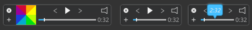

# Todi

 

Graphical MPD client (Qt 5.7)

#

This is a complete mess now! just wanted a small mpd client urgentlty .. so no regrets :) need to write the library(taken from abandoned QtMPD) from scratch completely

#Work in progress.. Priority Low!
